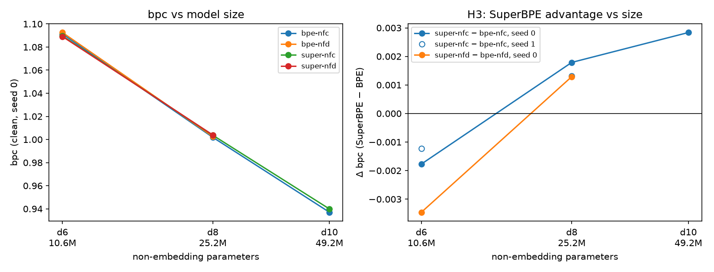

<div align="center">

# nanovitok

[](./pixi.toml)
[](https://pixi.sh)
[](https://www.kaggle.com/code)

**SuperBPE and NFD Tokenization for Small Vietnamese LMs**

</div>

---

## Overview

This project measures whether **merging tokens across whitespace** (SuperBPE [1]) and **decomposing diacritics**
(NFD) help small Vietnamese language models, and whether the effect changes with model size. Four tokenizers are
compared under an equal-text design (every condition trains on the same text) using
[nanochat](https://github.com/karpathy/nanochat) [3] models at three sizes: d6 / d8 / d10. The Python
package is `vitok`.

| | NFC | NFD |
|---|---|---|
| **BPE** | `bpe-nfc` (baseline) | `bpe-nfd` |
| **SuperBPE** | `super-nfc` | `super-nfd` |

---

## Design

| | |
|---|---|
| Tokenizers | 16k vocabulary, all trained on the same 500 MB of FineWeb-2 Vietnamese; full 256-byte alphabet; SuperBPE switches to cross-whitespace merges at 90% of the vocabulary. On FLORES-200, `bpe-nfc` needs 0.7% more tokens than the published MonTok BPE tokenizer with a 16,384 vocabulary [2] (`results/flores_ctc_16k.json`) |
| Equal text | Every condition trains for the same number of steps on 64 sequences per step; the context length in tokens is scaled by characters per token (1,024 for BPE, 840 for SuperBPE), so each step covers about the same text. Learning rate and weight decay are pinned to BPE's batch |
| Budget | 250M / 500M / 1B BPE tokens of text at d6 / d8 / d10 (3,814 / 7,629 / 15,258 steps), about 20 tokens per non-embedding parameter |
| Runs | Four conditions at d6 and d8; `bpe-nfc` and the better SuperBPE variant at d8 (`super-nfc`) at d10; a second seed for `bpe-nfc` and `super-nfc` at d6 and d8. Kaggle T4, fp16 |
| Metric | Bits per NFC character (never loss per token, never bytes: NFD text has more bytes), per document, on text normal, half stripped of diacritics, and fully stripped |
| Statistics | Paired bootstrap over documents (10,000 resamples). A difference is **resolved** only when its 95% interval excludes 0 *and* it exceeds the spread between the two seeds on the same text variant; the 1% margins are non-inferiority tests on the relative interval |

The hypotheses, margins and decision rules were committed before the first model was trained
([`docs/analysis_plan.md` at commit 4632328](https://github.com/geminitt/nanovitok/blob/4632328/docs/analysis_plan.md)).

---

## Results

Test set: 2,000 FineWeb-2 documents, scored per document from BOS; bpc = bits per NFC character.
Every number below is generated by `vitok.analysis` into [`results/summary.md`](./results/summary.md),
which also gives the confidence intervals and the rules each verdict follows.

| Hypothesis (pre-registered) | Result | Verdict |
|---|---|---|
| **H1** SuperBPE cuts tokens by ≥15% and costs at most 1% bpc | 17.8% fewer tokens at a 16k vocabulary; bpc −0.16% (d6), +0.18% (d8), +0.30% (d10), every 95% interval below +1% | supported |
| **H2** NFD tokenizers do better on text typed without diacritics, at ≤1% cost on normal text | NFD BPE at d6: −0.52% on half-stripped text but +0.78% on fully stripped text; every other comparison is within seed noise. Cost on normal text ≤0.11% | not supported |
| **H3** the SuperBPE effect changes with model size | Δbpc −0.0018 (d6) → +0.0018 (d8) → +0.0028 (d10): a small advantage turns into a small cost. The d6 → d8 sign change holds for both seeds; d10 has one seed | trend only (3 sizes) |
| **H4** superwords are words (exploratory) | 65.6% of superwords spanning 2–4 syllables are one underthesea word, against 57.0% for as many of the most frequent syllable runs (25.2% for all runs) | modestly above frequency |



**Caveats.**

- *Two metrics disagree on the sign at d8 and d10.* nanochat's own validation bpb ranks `super-nfc`
  ahead of `bpe-nfc` at every size (−0.86%, −0.46%, −0.35%), while the test bpc above puts it behind at
  d8 and d10. Both show the advantage shrinking with size. nanochat scores a fixed number of tokens,
  so the two tokenizers are evaluated on different val documents (SuperBPE covers 22% more text) and
  the comparison is unpaired; the test bpc is paired. The pre-registered check that would settle it,
  a paired evaluation on the val shard, has not been run yet.
- *Seed noise is a lower bound.* The seed changes weight initialization only; data order is fixed.
  It is 0.0005 bpc on normal text but up to 0.0095 on stripped text, which is why most H2 differences
  that a document bootstrap calls significant are not counted as resolved.
- *Equal text is approximate.* nanochat's loader packs documents and crops the one that overflows a
  row, so conditions see nearly but not exactly the same text (SuperBPE consumed about 0.4% more
  documents at d10).
- *Minimal pairs are at ceiling* (99.2–99.6% for every run), so they cannot separate the conditions.

**Deviations from the pre-registered plan.**

1. *d10 budget.* The plan cut d10 to d9 or to 60% of its budget if a run needed more than 6 hours. The
   `bpe-nfc` run trained for 10.0 hours (`super-nfc` 7.3); the full budget was kept, one condition per GPU,
   which fits a 12-hour Kaggle session. Both d10 runs were treated alike.
2. *Extra seed.* A second seed was also run at d6 (planned only at d8); it serves as a second noise reference.
3. *Deduplication.* The test set is deduplicated against the training text by exact document hash, not
   near-duplicate matching. A probe found 34 of 2,000 test documents sharing a 50-character chunk with the
   5,000-document val shard and none sharing half its text; leakage would affect every condition alike.
4. *Checks not performed.* Our bpc was not calibrated against nanochat's bpb (they are computed on
   different documents, see above). The pre-registered rerun of H1 on the val shard is pending.
5. *Analysis fixed after an audit (2026-09-26).* One pre-registered comparison (SuperBPE, NFD − NFC, half
   stripped) was missing; the 1% margins were reported as "interval excludes 0" instead of being tested;
   document-bootstrap significance ignored seed noise; H4 was compared with all syllable runs instead of
   the pre-registered frequency-matched baseline. The verdicts above use the corrected analysis.

---

## Reproduce

Training and evaluation run on Kaggle; the local environment is for code and CPU tests only.

1. **Code to Kaggle.** `git archive -o vitok-code.zip HEAD` and upload it as a Kaggle Dataset named
   `vitok-code` (or push to GitHub and set `VITOK_REPO` in the notebooks).
2. **Notebook 01** (`kaggle/notebooks/01_data_tokenizers.ipynb`, CPU, Internet on, `vitok-code`
   attached): Save & Run All. It downloads FineWeb-2 Vietnamese, writes the shards, the test set and
   the minimal pairs, trains the four tokenizers (16k; 32k only for the Gate 1 check), and prints Gate 1. Save its output as
   a Dataset named `vitok-data`.
3. **Notebook 02** (`kaggle/notebooks/02_train_eval.ipynb`, GPU T4 ×2, `vitok-data` and `vitok-code`
   attached): set `DEPTH`, `SEED`, `QUEUES`, `SMOKE_ITERS` in the first cell for each stage (smoke test
   with `SMOKE_ITERS=200`, then full runs with `None`: d6, d8, the second seeds, d10), then Save & Run All. Download each
   session's output into `kaggle/outputs/results-vN/`.
4. **Analysis** (CPU, local):

```bash
pixi install
git clone https://github.com/karpathy/nanochat third_party/nanochat
git -C third_party/nanochat checkout $(cat patches/NANOCHAT_COMMIT)
git -C third_party/nanochat apply ../../patches/nanochat.patch
pixi run test
pixi run python -m vitok.wordhood --tokenizers kaggle/outputs/vitok-data/tokenizers-16k \
    --docs kaggle/outputs/vitok-data/test.jsonl --out results/wordhood_16k.json
pixi run python -m vitok.analysis --results kaggle/outputs \
    --compression kaggle/outputs/vitok-data/compression-16k.json \
    --wordhood results/wordhood_16k.json --out results/summary.md --figures figures
```

---

## Structure

```
src/vitok/        data, tokenizer training (SuperBPE stage 2 in numpy), nanochat wrapper, evaluation, statistics, analysis
tests/            pytest (pixi run test)
patches/          nanochat patch + pinned commit
kaggle/notebooks/ 01 data + tokenizers (CPU), 02 train + evaluate (T4 ×2)
kaggle/outputs/   vitok-data/ (tokenizers, test set, minimal pairs, notebook 01 log);
                  results-v4 … v9/ (per-run results JSON and training logs)
results/          summary.md (every table and verdict), wordhood, FLORES comparison, Gate 3 decision
figures/          H3 figure
```

---

## References

1. Liu et al. **SuperBPE: Space Travel for Language Models.** COLM 2025. [arXiv:2503.13423](https://arxiv.org/abs/2503.13423)
2. Arnett et al. **Explaining and Mitigating Crosslingual Tokenizer Inequities.** NeurIPS 2025. [arXiv:2510.21909](https://arxiv.org/abs/2510.21909) — Vietnamese compression numbers used for comparison; [MonTok](https://huggingface.co/datasets/catherinearnett/montok) tokenizers
3. Karpathy. **nanochat.** 2025. [GitHub](https://github.com/karpathy/nanochat) (MIT)
4. Penedo et al. **FineWeb2.** 2025. [arXiv:2506.20920](https://arxiv.org/abs/2506.20920) — training and test data
5. NLLB Team. **No Language Left Behind.** 2022. [arXiv:2207.04672](https://arxiv.org/abs/2207.04672) — FLORES-200
6. Sennrich et al. **Neural Machine Translation of Rare Words with Subword Units.** ACL 2016. [arXiv:1508.07909](https://arxiv.org/abs/1508.07909) — BPE
7. Chowdhury & Woolf. **Benchmarking BPE Tokenizers on Different Languages with Bits per Byte.** MeLLM 2026. [ACL Anthology](https://aclanthology.org/2026.mellm-1.27/)
8. Lee et al. **Equity with Efficiency: An Empirical Study of Tokenizers for Multilingual LLMs.** 2026. [arXiv:2606.15044](https://arxiv.org/abs/2606.15044)
9. Altıntaş et al. **TokSuite.** ICML 2026. [arXiv:2512.20757](https://arxiv.org/abs/2512.20757)

Tools: [HF tokenizers](https://github.com/huggingface/tokenizers) · [SuperBPE code](https://github.com/PythonNut/superbpe) · [underthesea](https://github.com/undertheseanlp/underthesea) (word segmentation for H4)

---

## Data

The text in `kaggle/outputs/vitok-data/` is extracted from [FineWeb-2](https://huggingface.co/datasets/HuggingFaceFW/fineweb-2)
(`vie_Latn`, licensed under [ODC-By 1.0](https://opendatacommons.org/licenses/by/1-0/)). The original parquet shards
are not in the repo; `vitok.data` downloads them again. FLORES-200 is downloaded when `vitok.flores_ctc` runs
(CC BY-SA 4.0).
