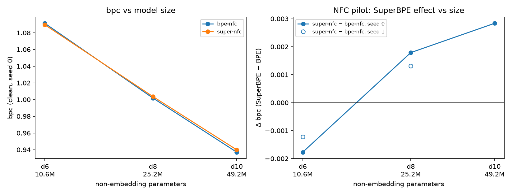

<div align="center">

# nanovitok

[](https://github.com/geminitt/nanovitok/actions/workflows/ci.yml)
[](./pixi.toml)
[](https://www.kaggle.com/code)
[](./LICENSE)

**SuperBPE and NFD Tokenization for Small Vietnamese LMs**

</div>

---

## Overview

A language model reads tokens, and the tokenizer decides how text is cut into them. Vietnamese raises two
questions that English does not:

| Property of Vietnamese | What standard BPE does | Alternative tested |
|---|---|---|
| Spaces separate **syllables**, and most words have several (`học sinh`, `Việt Nam`) | Never merges across a space, so every syllable costs at least one token | **SuperBPE** [1] merges across spaces, so the same text needs fewer tokens |
| Tones and vowel qualities are **diacritics**, and much text is typed without them | NFC encodes `ệ` as one character, so `học` and `hoc` share nothing | **NFD** writes `ệ` as `e` plus two combining marks, so `học` and `hoc` share their base letters |

Fewer tokens make training and inference cheaper and fit more text into a context.

**Question.** For small Vietnamese language models, are these two choices worth it: do they bring their gain
(fewer tokens; better handling of text without diacritics) without making the model predict text worse?

Four tokenizers are compared under an equal-text design (every condition trains on the same text) using
[nanochat](https://github.com/karpathy/nanochat) [3] models at three sizes: d6 / d8 / d10. "Predicting worse"
is measured in bits per NFC character (bpc): the model's cross-entropy on a document, in bits, divided by its
number of characters, which every tokenizer shares. The Python package is `vitok`.

| | NFC | NFD |
|---|---|---|
| **BPE** | `bpe-nfc` (baseline) | `bpe-nfd` |
| **SuperBPE** | `super-nfc` | `super-nfd` |

| Hypothesis | Part of the question it answers |
|---|---|
| **H1** (main) | Does SuperBPE save tokens without costing bpc? |
| **H2** | Does NFD help on text without diacritics without costing bpc on normal text? |
| **H3** | Does the answer to H1 change with model size? (the scope of H1) |
| **H4** (exploratory) | Are SuperBPE's merged tokens Vietnamese words? (a mechanism, not a claim) |

**Answer.** At 10–50M non-embedding parameters, SuperBPE cuts tokens by 17.8% at a negligible cost in bpc (at
most +0.30%); NFD shows no measurable benefit on text without diacritics; and SuperBPE's small cost grows with
model size, so the result is not known to hold for larger models.

---

## Design

| | |
|---|---|
| Tokenizers | 16k vocabulary, all trained on the same 500 MB of FineWeb-2 Vietnamese; full 256-byte alphabet; SuperBPE switches to cross-whitespace merges at 90% of the vocabulary. On FLORES-200, `bpe-nfc` needs 0.7% more tokens than the published MonTok BPE tokenizer with a 16,384 vocabulary [2] (`results/flores_ctc_16k.json`) |
| Equal text | Every condition trains for the same number of steps on 64 sequences per step; the context length in tokens is scaled by characters per token (1,024 for BPE, 840 for SuperBPE), so each step covers about the same text. Learning rate and weight decay are pinned to BPE's batch. The SuperBPE paper matches training FLOPs instead; with equal text, SuperBPE trains on fewer tokens and so with 21% less compute (3.45·10¹⁷ against 4.35·10¹⁷ FLOPs at d10, from `train.log`) |
| Budget | 250M / 500M / 1B BPE tokens of text at d6 / d8 / d10 (3,814 / 7,629 / 15,258 steps), about 20 tokens per non-embedding parameter |
| Runs | Four conditions at d6 and d8; `bpe-nfc` and the better SuperBPE variant at d8 (`super-nfc`) at d10; a second seed for `bpe-nfc` and `super-nfc` at d6 and d8. Kaggle T4, fp16 |
| Metric | Bits per NFC character (never loss per token, never bytes: NFD text has more bytes), per document, on text normal, half stripped of diacritics, and fully stripped |
| Statistics | Paired bootstrap over documents (10,000 resamples). A difference is **resolved** only when its 95% interval excludes 0 *and*, where a second seed exists (d6, d8), it passes a t test against run-to-run noise: \|Δ\| > t(0.975, 2) × RMS of the two seed spreads on the same text variant (4.30 ×), an approximate noise estimate (see the caveats). The 1% margins are non-inferiority tests on the relative interval |

The hypotheses, margins and decision rules were committed before the first model was trained
([`docs/analysis_plan.md` at commit 4632328](https://github.com/geminitt/nanovitok/blob/4632328/docs/analysis_plan.md)).

---

## Results

Test set: 2,000 FineWeb-2 documents, scored per document from BOS (1,996 fit every model's context and are
compared); bpc = bits per NFC character. The numbers in the table and the caveats come from
[`results/summary.md`](./results/summary.md), generated by `vitok.analysis`, which also gives every confidence
interval and the rule behind each verdict; CI regenerates that file from the committed results and fails if it
changes. The few other numbers name their source.

| Hypothesis (pre-registered) | Result | Verdict |
|---|---|---|
| **H1** SuperBPE cuts tokens by ≥15% and costs at most 1% bpc | 17.8% fewer tokens at a 16k vocabulary; bpc −0.16% (d6), +0.18% (d8), +0.30% (d10), every 95% interval below +1%. The val shard gives the same signs (−0.18%, +0.20%, +0.28%) | supported |
| **H2** NFD tokenizers do better on text typed without diacritics, at ≤1% cost on normal text | One of eight stripped-text comparisons clears the noise test: NFD BPE at d6 on half-stripped text (−0.52%), and it does not recur at d8. The largest raw difference, +0.78% for NFD BPE on fully stripped text at d6, stays below the noise threshold there (0.025 bpc). Cost on normal text ≤0.11% | not supported |
| **H3** the SuperBPE effect changes with model size | Δbpc −0.0018 (d6) → +0.0018 (d8) → +0.0028 (d10): a small advantage turns into a small cost. The d6 → d8 sign change holds for both seeds; d10 has one seed | trend only (3 sizes) |
| **H4** superwords are words (exploratory) | 65.6% of superwords spanning 2–4 syllables are one underthesea word, against 57.0% for as many of the most frequent syllable runs (25.2% for all runs) | modestly above frequency |



**Caveats.**

- *nanochat's own validation bpb disagrees, and is the one that is off.* It ranks `super-nfc` ahead of
  `bpe-nfc` at every size (−0.86%, −0.46%, −0.35%), while the test bpc puts it behind at d8 and d10.
  nanochat scores a fixed number of tokens, so the two tokenizers are evaluated on different val
  documents (SuperBPE covers 22% more text), packed several to a row. Scored like the test set instead
  (per document from BOS, the same 4,963 val documents for every run), the val shard agrees with the
  test set at every size and for both normalizations (`results/summary.md`, "Sensitivity of H1 on the
  val shard"): the disagreement comes from nanochat's evaluation, not from the data split.
- *Run-to-run noise decides H2, and its estimate can be off in either direction.* Retraining the same
  condition with another seed moves bpc by up to 0.0005 on normal text but up to 0.0095 on stripped text.
  With only two seed pairs to estimate that noise, a difference must exceed 4.3 times its root mean square
  (Student's t, 2 degrees of freedom) to count; comparing with a single spread instead would flag a third of
  pure-noise differences. Two things bias the estimate, in opposite directions. The seed changes the weight
  initialization but not the data order, so data-order noise is left out (the threshold is too low). And
  with the same seed every condition starts from identical weights (all share the same parameter shapes;
  checked on CPU with nanochat's initialization code), so that shared part cancels in a difference between
  two conditions, which a spread between two seeds of one condition does not reflect (the threshold is too
  high). The spreads also come from the two NFC conditions only and are applied to the NFD comparisons.
  Under a tighter estimate, the largest H2 difference could resolve the other way: NFD BPE is +0.78% worse
  on fully stripped text at d6 (0.0171 bpc against a threshold of 0.025).
- *H1's intervals cover the choice of documents, not seed noise.* Adding the normal-text noise threshold of
  d6 and d8 (0.0014 bpc, about 0.15% of d10's bpc) to the largest upper bound (+0.36% at d10) still gives
  about +0.5%, well inside the 1% margin.
- *Equal text is approximate.* nanochat's loader packs documents and crops the one that overflows a
  row, so conditions see nearly but not exactly the same text (SuperBPE consumed about 0.4% more
  documents at d10, by the data position in each `train.log`).
- *Minimal pairs are at ceiling* (99.2–99.6% for every run), so they cannot separate the conditions.

**Deviations from the pre-registered plan.**

1. *d10 budget.* The plan cut d10 to d9 or to 60% of its budget if a run needed more than 6 hours. The
   `bpe-nfc` run trained for 10.0 hours (`super-nfc` 7.3); the full budget was kept, one condition per GPU,
   which fits a 12-hour Kaggle session. Both d10 runs were treated alike.
2. *Extra seed.* A second seed was also run at d6 (planned only at d8); it serves as a second noise reference.
3. *Deduplication.* The test set is deduplicated against the training text by exact document hash, not
   near-duplicate matching. A probe found 34 of 2,000 test documents sharing a 50-character chunk with the
   5,000-document val shard and none sharing half its text; leakage would affect every condition alike.
4. *Checks done late or not at all.* Our bpc was not calibrated against nanochat's bpb (they are computed
   on different documents, see above). The pre-registered rerun of H1 on the val shard was run after the
   audit, on a local GPU (the scores of one checkpoint on the test set matched Kaggle's to 2·10⁻⁴ per
   document), and agrees with the test set.
5. *Analysis fixed after an audit (2026-09-26).* One pre-registered comparison (SuperBPE, NFD − NFC, half
   stripped) was missing; the 1% margins were reported as "interval excludes 0" instead of being tested;
   document-bootstrap significance ignored seed noise (it is now a t test on the seed spreads); H4 was
   compared with all syllable runs instead of the pre-registered frequency-matched baseline. The verdicts
   above use the corrected analysis.

**What would settle H2.** More seeds for all four conditions (each d6 run takes about 40 minutes on a T4),
seeds that also change the data order, and a second seed at d10. With several seeds per condition, the noise
of a difference is measured directly, as the spread of that difference across seeds, instead of assumed.

---

## Reproduce

Training and the test-set evaluation run on Kaggle (steps 1–3). Locally, the default environment runs the
tests and the analysis on CPU, and the `gpu` environment scores finished checkpoints on the val shard.

1. **Code to Kaggle.** `git archive -o vitok-code.zip HEAD` and upload it as a Kaggle Dataset named
   `vitok-code` (or push to GitHub and set `VITOK_REPO` in the notebooks).
2. **Notebook 01** (`kaggle/notebooks/01_data_tokenizers.ipynb`, CPU, Internet on, `vitok-code`
   attached): Save & Run All. It downloads FineWeb-2 Vietnamese, writes the shards, the test set and
   the minimal pairs, trains the four tokenizers (16k; 32k only for the Gate 1 check), and prints Gate 1. Save its output as
   a Dataset named `vitok-data`.
3. **Notebook 02** (`kaggle/notebooks/02_train_eval.ipynb`, GPU T4 ×2, `vitok-data` and `vitok-code`
   attached): set `DEPTH`, `SEED`, `QUEUES`, `SMOKE_ITERS` in the first cell for each stage (smoke test
   with `SMOKE_ITERS=200`, then full runs with `None`: d6, d8, the second seeds, d10), then Save & Run All. Download each
   session's output into `kaggle/outputs/results-vN/`.
4. **Setup and val-shard check** (local). `vitok.fetch_checkpoints` downloads each run's final checkpoint
   from the notebook 02 version that saved it (14 runs, 3.75 GB; needs a Kaggle API token) and gives each
   run the tokenizer it was trained with. For your own runs, edit `NOTEBOOK` and `RUNS` in that module.
   Then score every run on the val shard (local GPU; the scoring took 27 minutes on an RTX 1000 Ada 6 GB,
   the sum of `eval_seconds` in `results/val/`). `val_docs.jsonl` is committed; `vitok.val_docs` rebuilds it
   from notebook 01's val shard.

```bash
pixi install
git clone https://github.com/karpathy/nanochat third_party/nanochat
git -C third_party/nanochat checkout $(cat patches/NANOCHAT_COMMIT)
git -C third_party/nanochat apply ../../patches/nanochat.patch
pixi run test
pixi run python -m vitok.fetch_checkpoints --out kaggle/outputs
# only if val_docs.jsonl is missing (shards/ is in notebook 01's output, not in the repo)
pixi run python -m vitok.val_docs --shard kaggle/outputs/vitok-data/shards/shard_99999.parquet \
    --out kaggle/outputs/vitok-data/val_docs.jsonl
pixi run -e gpu python -m vitok.eval_checkpoints --runs kaggle/outputs \
    --docs kaggle/outputs/vitok-data/val_docs.jsonl --nanochat third_party/nanochat --out results/val
```

5. **Analysis** (CPU, local):

```bash
pixi run python -m vitok.wordhood --tokenizers kaggle/outputs/vitok-data/tokenizers-16k \
    --docs kaggle/outputs/vitok-data/test.jsonl --out results/wordhood_16k.json
pixi run python -m vitok.analysis --results kaggle/outputs \
    --compression kaggle/outputs/vitok-data/compression-16k.json \
    --wordhood results/wordhood_16k.json --val-results results/val \
    --out results/summary.md --figures figures
```

---

## Structure

```
src/vitok/        data, tokenizer training (SuperBPE stage 2 in numpy), nanochat wrapper, evaluation, statistics, analysis
tests/            pytest (pixi run test)
patches/          nanochat patch + pinned commit
kaggle/notebooks/ 01 data + tokenizers (CPU), 02 train + evaluate (T4 ×2)
kaggle/outputs/   vitok-data/ (16k tokenizers, compression at 16k and 32k, test and val documents,
                  minimal pairs, notebook 01 log); results-v4 … v9/ (per-run test results, training logs,
                  throughput)
results/          summary.md (every table and verdict), val/ (per-run val-shard scores), wordhood,
                  FLORES comparison, Gate 3 decision
figures/          H3 figure
```

---

## References

1. Liu et al. **SuperBPE: Space Travel for Language Models.** COLM 2025. [arXiv:2503.13423](https://arxiv.org/abs/2503.13423)
2. Arnett et al. **Explaining and Mitigating Crosslingual Tokenizer Inequities.** NeurIPS 2025. [arXiv:2510.21909](https://arxiv.org/abs/2510.21909) — Vietnamese compression numbers used for comparison; [MonTok](https://huggingface.co/datasets/catherinearnett/montok) tokenizers
3. Karpathy. **nanochat.** 2025. [GitHub](https://github.com/karpathy/nanochat) (MIT)
4. Penedo et al. **FineWeb2.** 2025. [arXiv:2506.20920](https://arxiv.org/abs/2506.20920) — training and test data
5. NLLB Team. **No Language Left Behind.** 2022. [arXiv:2207.04672](https://arxiv.org/abs/2207.04672) — FLORES-200
6. Sennrich et al. **Neural Machine Translation of Rare Words with Subword Units.** ACL 2016. [arXiv:1508.07909](https://arxiv.org/abs/1508.07909) — BPE
7. Chowdhury & Woolf. **Benchmarking BPE Tokenizers on Different Languages with Bits per Byte.** MeLLM 2026. [ACL Anthology](https://aclanthology.org/2026.mellm-1.27/)
8. Lee et al. **Equity with Efficiency: An Empirical Study of Tokenizers for Multilingual LLMs.** 2026. [arXiv:2606.15044](https://arxiv.org/abs/2606.15044)
9. Altıntaş et al. **TokSuite.** ICML 2026. [arXiv:2512.20757](https://arxiv.org/abs/2512.20757)

Tools: [HF tokenizers](https://github.com/huggingface/tokenizers) · [SuperBPE code](https://github.com/PythonNut/superbpe) · [underthesea](https://github.com/undertheseanlp/underthesea) (word segmentation for H4)

---

## Data

The text in `kaggle/outputs/vitok-data/` is extracted from [FineWeb-2](https://huggingface.co/datasets/HuggingFaceFW/fineweb-2)
(`vie_Latn`, licensed under [ODC-By 1.0](https://opendatacommons.org/licenses/by/1-0/)). The original parquet shards
are not in the repo; `vitok.data` downloads them again. FLORES-200 is downloaded when `vitok.flores_ctc` runs
(CC BY-SA 4.0).
