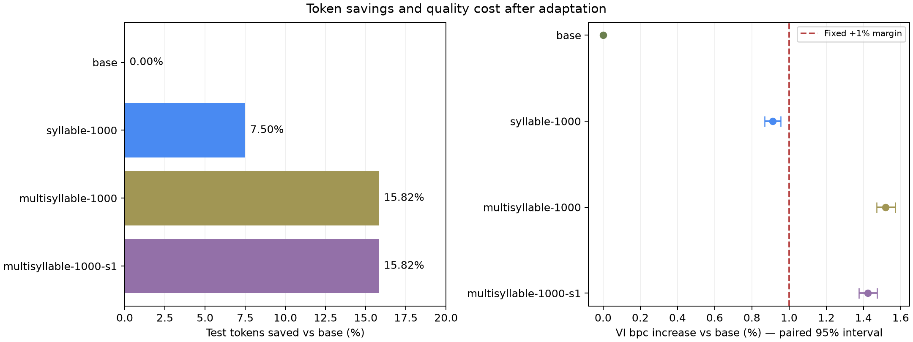
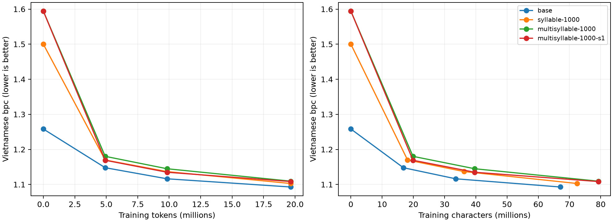
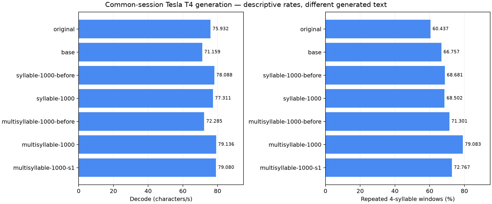

<div align="center">

# nanovitok

[](https://github.com/geminitt/nanovitok/actions/workflows/ci.yml)
[](./pixi.toml)
[](https://www.kaggle.com/code)
[](./LICENSE)

**Adapting an LLM with Vietnamese Multi-Syllable Tokens**

</div>

---

## Question

Does adding Vietnamese multi-syllable tokens to an existing LLM reduce processing cost while keeping quality,
under a small adaptation budget?

We extend Qwen3-0.6B's tokenizer by continuing its BPE merges. The main extension may join syllables across spaces
(for example, học sinh); a syllable-only extension is the control. Existing token IDs stay fixed. Each new token
embedding is initialized to the mean of the original embeddings of its pieces; input and output weights are tied.

**Result.** Multi-syllable tokens save more test tokens and show higher descriptive decode characters/s, but both
seeds fail the quality margin fixed before the runs. The syllable-only extension saves fewer tokens and meets that
margin. Pronounced repetition in greedy continuations limits what the measured generation rates establish.

---

## Design

| Item | Fixed protocol |
|---|---|
| Source model | [Qwen3-0.6B](https://huggingface.co/Qwen/Qwen3-0.6B), revision c1899de289a04d12100db370d81485cdf75e47ca |
| Conditions | base: unchanged tokenizer; syllable: within syllables; multisyllable: may cross spaces |
| Vocabulary addition | 1,000 tokens, chosen by a development probe before the full runs |
| Trainable parameters | New embedding rows plus transformer layers 0, 1, 26 and 27; existing token rows frozen |
| Budget | 1,200 steps × 32 sequences × 512 tokens = 19,660,800 processed tokens per condition |
| Data order | Same ordered FineWeb-2 Vietnamese stream, deduplicated against test and merge-learning documents |
| Quality | Canonical-tokenization bits per NFC character on the same 2,000 Vietnamese test documents |
| Checks | 2,000 English documents; 900 Belebele vie_Latn items, zero-shot per-character answer scoring |
| Decision rule | Relative VI bpc vs base: upper 95% bound below +1%; paired bootstrap, 10,000 resamples, seed 0 |

The protocol matches processed tokens and steps. Multi-syllable tokens cover more text per step; exact training
FLOPs are unmeasured. One base seed and two multi-syllable seeds were run. Intervals resample documents and do not
cover full training-seed uncertainty.

---

## Results



The dashed line is the fixed +1% quality margin. Error bars resample paired test documents, not training seeds.

Bits per character is the total negative log probability of the reference text's canonical token sequence,
divided by its NFC character count and ln(2). Documents are scored given an end-of-text context token; spaces and
punctuation count as characters. This evaluates fixed held-out text. Likelihood marginalized over every possible
tokenization of the same text is unmeasured.



Adding tokens initially increases bpc; continued training recovers much of that cost. Continued training also
improves the unchanged-tokenizer baseline. The full [generated report](./results/adaptation.md) includes original,
zero-shot, snapshot and final scores, the English check and paired Belebele comparisons. Belebele does not show a
clear improvement over base under this protocol.

### Transfer checks

| Condition | EN bpc | Belebele |
|---|---:|---:|
| base | 1.061271 | 35.00% |
| syllable-1000 | 1.063913 | 35.22% |
| multisyllable-1000 | 1.065679 | 35.33% |
| multisyllable-1000-s1 | 1.065461 | 35.33% |

These are descriptive final scores; the report gives the paired comparisons. Small accuracy differences do not
establish a downstream improvement.

### Generation

20 paired prompts; 256 greedy new tokens; fp16; two Tesla T4 GPUs.



Repetition is the mean share of repeated 4-syllable windows in each generated continuation. Text differs across models; these descriptive rates do not measure the throughput of equally useful text.
Base/syllable use GPU 0 and multisyllable uses GPU 1; physical-device variation is not separated.
Notebook wall time: 1127.766 seconds, excluding platform startup/teardown.


| Model | Prefill chars/s | Peak GiB |
|---|---:|---:|
| base | 7918.752 | 3.449 |
| multisyllable-1000 | 8107.866 | 3.449 |
| multisyllable-1000-before | 7843.946 | 3.449 |
| multisyllable-1000-s1 | 8029.422 | 3.449 |
| original | 7972.040 | 3.449 |
| syllable-1000 | 7774.054 | 3.450 |
| syllable-1000-before | 7887.778 | 3.450 |

Rates describe different generated text, not equally useful output. Memory is peak PyTorch allocated memory,
not total GPU usage; base/syllable and multisyllable were measured on different physical T4s in the same session.

### Training limitation

fp16 scaling skipped updates on non-finite gradients. All saved tensors and logged losses are finite. The
processed-token budgets match; successful optimizer-update counts differ, as recorded in the generated report.
No further training was used to change the fixed comparison after seeing the results.

---

## Reproduce

The [measurement bundle](./results/adaptation/manifest.json) records commits, model revision, source kernels and
sha256 hashes of the committed per-document/per-prompt measurements. Final weights remain in the Kaggle outputs.
The analysis is deterministic; CI regenerates both reports and this README and checks for any difference.

```bash
pixi install
pixi run python -m vitok.report --data results/adaptation --out results/adaptation.md \
    --readme README.md --figures figures
```

The [retained tokenizer survey](./results/adaptation.md#retained-tokenizer-survey) is a tokenizer-only comparison.
Its original command was recovered; the pinned remeasurement matches the historical rounded values. To remeasure
it from tokenizer files and the committed test/validation documents (downloads tokenizer files, not model weights):

```bash
pixi run python -m vitok.survey --recorded results/adaptation/tokenizers/survey.json \
    --docs-root kaggle/outputs/vitok-data --out /tmp/tokenizer-survey.json
```

To reproduce the GPU experiment, use [notebook 03](./kaggle/notebooks/03_adaptation.ipynb) for the development probe
and full adaptation queues, then [notebook 04](./kaggle/notebooks/04_generation_speed.ipynb) for every generation
measurement in one T4 session. Attach the vitok-code/vitok-data bundles and both adaptation outputs as described
in the notebooks. The input bundle is built by vitok.kaggle_session.build_bundle from a committed checkout,
retrofit tokenizer outputs and the pinned held-out files.

The main CLIs are vitok.retrofit, vitok.extend, vitok.cpt_data, vitok.adapt, vitok.heldout, vitok.score,
vitok.compare and vitok.report. Training resumes from checkpoints; scoring resumes item by item under a matching
signature. Default/dev environments run the CPU suite; the gpu environment provides CUDA PyTorch.

## NFC pilot evidence

The retained [from-scratch NFC pilot](./results/summary.md) compares BPE and SuperBPE under its earlier equal-text
design, including second seeds, model-size trends and the val-shard check. Its models and budget differ from the
Qwen3 retrofit; it serves as tokenization-only evidence. nanochat's fixed-token validation bpb scores different
documents between tokenizers, so the paired per-document bpc is used for conclusions.


```bash
git clone https://github.com/karpathy/nanochat third_party/nanochat
git -C third_party/nanochat checkout $(cat patches/NANOCHAT_COMMIT)
git -C third_party/nanochat apply ../../patches/nanochat.patch
pixi run python -m vitok.analysis --results kaggle/outputs \
    --compression kaggle/outputs/vitok-data/compression-16k.json \
    --val-results results/val --out results/summary.md --figures figures
pixi run -e dev check
```

The dropped NFD, stripped-text, minimal-pairs, wordhood and FLORES branches remain available in Git history at
[f2bb633](https://github.com/geminitt/nanovitok/tree/f2bb633); they are outside the current research question.

---

## Sources and license

- [Qwen3](https://huggingface.co/Qwen/Qwen3-0.6B): source model and tokenizer.
- [SuperBPE](https://arxiv.org/abs/2503.13423): cross-whitespace BPE merges; [reference implementation](https://github.com/PythonNut/superbpe).
- [FineWeb-2](https://huggingface.co/datasets/HuggingFaceFW/fineweb-2): Vietnamese corpus, ODC-By 1.0.
- [FineWeb](https://huggingface.co/datasets/HuggingFaceFW/fineweb): pinned sample-10BT English documents.
- [Belebele](https://huggingface.co/datasets/facebook/belebele): downstream multilingual reading-comprehension check.
- [nanochat](https://github.com/karpathy/nanochat): the from-scratch pilot, pinned and patched under patches/.

Code is [MIT licensed](./LICENSE). Corpus/model assets retain their respective licenses.
